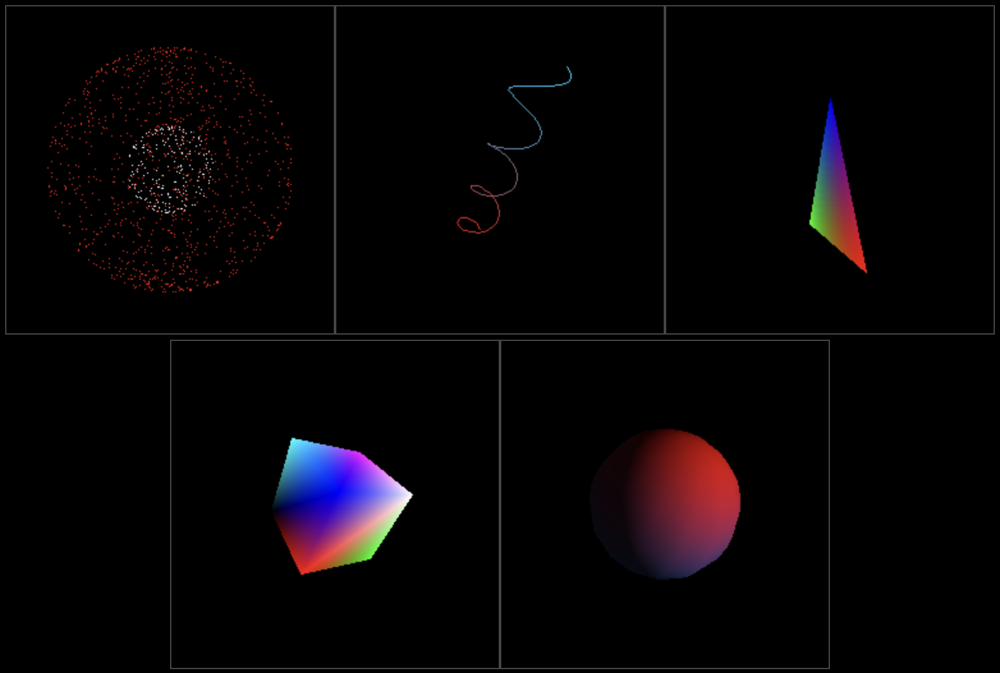

# Tucunaré

## [Live Demo](https://jordoreed.github.io/tucunare/examples/build/index.html)

A simple 3D graphics rendering pipeline for the HTML5 Canvas.

(NOTE: Not really meant for production :). Use [WebGL](https://get.webgl.org/) or [WebGPU](https://developer.chrome.com/en/docs/web-platform/webgpu/) instead.)

| Code Examples                                      |
| :------------------------------------------------- |
| [Points](./examples/src/components/Points.tsx)     |
| [Lines](./examples/src/components/Lines.tsx)       |
| [Triangle](./examples/src/components/Triangle.tsx) |
| [Cube](./examples/src/components/Cube.tsx)         |
| [Sphere](./examples/src/components/Sphere.tsx)     |

# What does "tucunaré" mean?

Tucunaré is the Brazilian name for [Peacock Bass](https://en.wikipedia.org/wiki/Peacock_bass), a colorful fish in the Amazon region.
